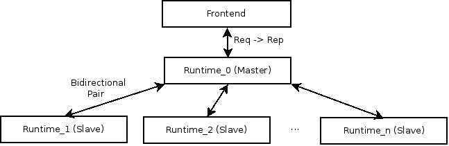

MultiAgentSystem
================

A scalable multi-agent system developed using Node.js.

## Description

The goal of this project is developing the prototype of a distributed and scalable
multi-agent simulator using the knowledge obtained in the CCTAS (Cloud Computing: 
Technologies & Services) subject.

The architecture designed for the project has the following components:

* __Runtime component__: the runtime component is in charge of executing the agent
simulation. At least one instance of this component must exist, up to _N_ instances
of this component can exist. If there is more than one instance of the runtime,
one of the instances will act as the _master_ runtime component and the other
instances as _slave_ instances. The _master_ instance is in charge of starting and
stopping the simulation, synchronizing the different _slave_ components with eachother
and of communicating with the frontend.

* __Frontend component__: the frontend component exposes the behavior of the simulator
to the user through a HTTP REST API and through an included Web application, allowing
the user to visualize the result of the simulation on its various steps. Only one
instance of this component should exist.

The source folders _/src/runtime_, _/src/frontend_ and _/src/frontend/viewer
contain detailed information about the behavior of both components and of its structure.

## Status

The project is not finished and is missing some important aspects of its architecture. The
following table lists the intended features of the service and its development status. A
circle represents features that have been implemented, while crosses represent features that
have not been implemented. Tildes represent features which implementation has been started
but is not functional or is incomplete.

### Simulator:

| Feature | Description | Status |   
|:-:	|:-:	|:-:	|
| Vector simulation | _Being able to execute a simulation using a vectorial environment_ | O |
| Raster simulation | _Being able to execute a simulation using a rasterized environment_ | X |
| Agent prototypes | _Agent code can be expanded from a predefined interface_ | O |
| In-component bounding | _Only simulating the agents located in the bounds of the local instance_ | O |
| Inter-instance communication | _Being able to communicate the master runtime component with the slave components_ | ~ (Started) |
| Inter-instance agent transfer | _Being able to transfer an agent from one runtime instance to other_ | X | 
| Agent-environment interaction | _Agents are able to interact with the environment_ | O |
| Agent-agent interaction | _Agents are able to interact with other agents_ | O |
| Inter-instance agent communication | _Agents are able to interact with agents or the environment on other runtime instance_ | X |
| Load balancing | _Simulation bounds are balanced depending on the cardinality_ | X |
| Simulation state consistency | _The state of the simulation is consistent across all the instances_ | X |

### Frontend

| Feature | Description | Status |   
|:-:	|:-:	|:-:	|
| Frontend-master communication | _The frontend can communicate with the master simulator instance_ | O |
| Simulator control from frontend | _The behavior of the simulator can be controlled from the frontend_ | O |
| Simulator REST HTTP API | _The simulator can be controlled using HTTP commands through the frontend_ | O |
| Web interface | _The simulator can be controlled and its result viewed from an easy to use Web application_ | O |
| Submit simulations | _The simulation initialization files can be submitted through the frontend_ | X |

## Running

On its current state, the only way of executing the service is starting up its instances
manually. To do so, execute from a terminal:

`$ cd ./src/runtime`

`$ node main.js <index> <cardinality> &`   

`$ cd ../frontend`    

`$ node main.js`

With _index_ being the instance number of the component and _cardinality_ the total
instances created of the component.

The service has been developed under Debian Linux using Node.JS 4.1.0 and ZeroMQ 
4.0.5. It is untested under other platforms or versions. It requires having the 
ZeroMQ library installed along with its Node.JS wrapper.

## License and contribution

This project has been developed with learning purposes. It is distributed as-is, without
any explicit gurantee of support or continuation of development. If you want to contribute
or have any question, feel free to fork the project or email me at <mailto:cegonse@posgrado.upv.es>.

It is licensed under the _GNU General Public License v3_. You should have obtained a copy
of the license with this files, if not see see <http://www.gnu.org/licenses/>.
