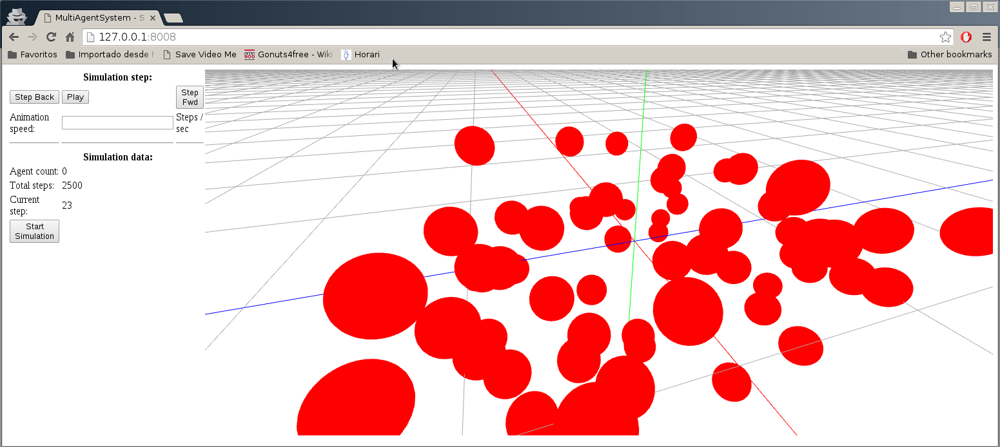

Frontend component
==================

The frontend component is used to interface the simulator with the user through a 
HTTP REST API or through the included Web application. The component consists of
the following files:

* _main.js_: entry point of the component, creates the HTTP server and calls the
handler method when a request is received.

* _handler.js_: contains the method invoked when the frontend receives a HTTP request.
Depending on the received request, the frontend communicates with the master runtime
instance to issue a command to the simulator, and returns the result. It also is
in charge of 

* _viewer folder_: contains the HTML, Javascript, CSS and libraries of the frontend
Web application.

## REST API

The REST API has the following commands, all expected to be GET HTTP requests and answered
with the following JSON responses:

* _/start_: the _start_ command starts the simulation with the embedded simulation file,
included in _/res/exampleSimulation.json_. The response is a JSON object with the parameters:

> ack / err: ack if the command succeeded, err if the command failed.

> data: _ok_ if the command succeeded, otherwise a string explaining the error.

* _/step?ind=<index>_: obtains the environment for the step passed as an argument in _ind_.
The response follows the same syntax as the previous command, and if the command suceeds
the _data_ field will contain the environment in the defined step as a JSON with the same
syntax as in the runtime.

* _/status_: returns the progress rate of the simulation in a range between 0.0 and 100.0 as
a a percentage if succeeds, or error otherwise.

## Web application

The Web application is a simple interface for the user to use the simulator, implemented
using WebGL.

The Web application is accesed on the "/" path of the web server.

